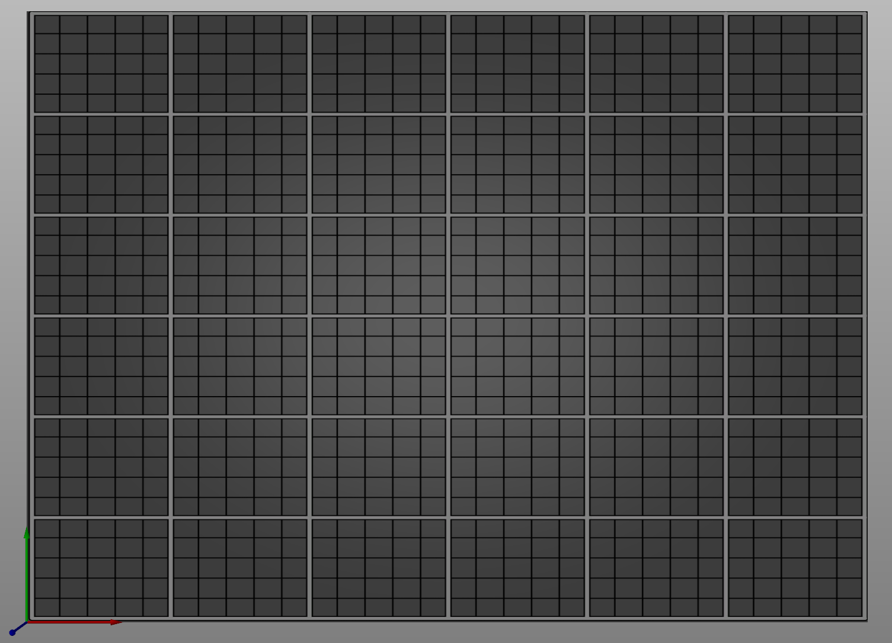
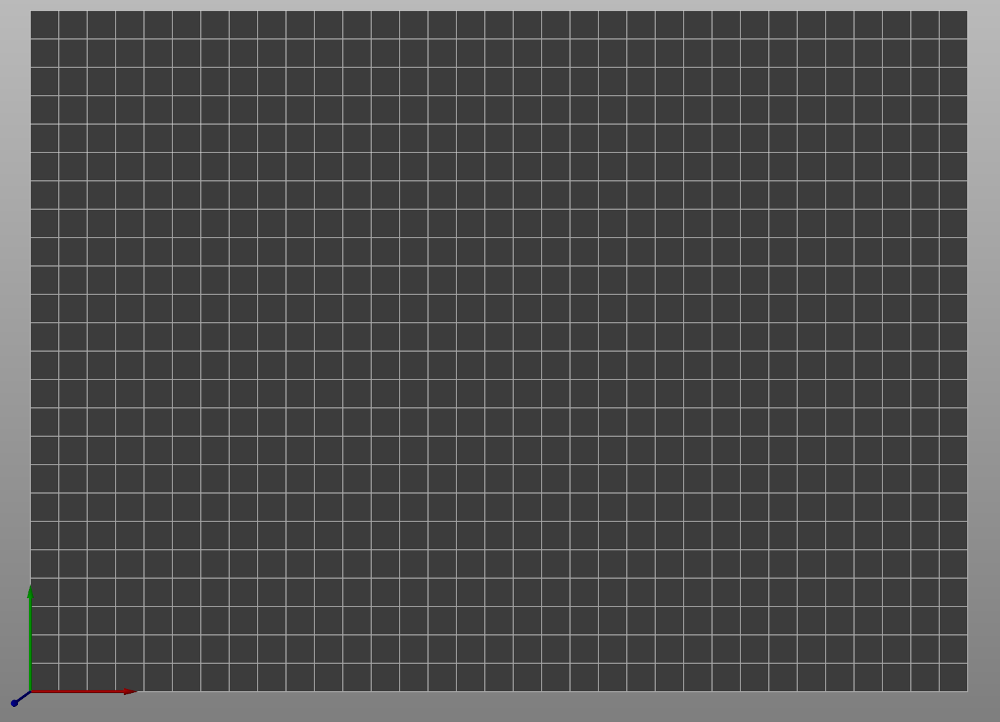

# Raise3D-E2
Profile for Raise3D E2 printer for use in PrusaSlicer 2.3.0-Beta3 and newer.

### Profile status
As of now, the profiles are in working state, they don't print pretty, but IDEX and different modes are working:

##### What works:
* Left printhead mode
* Right printhead mode
* Mirror mode
* Duplicate mode

##### What sort of works:
* Dual extrusion, some users have had mixed experience with this, need to check.

##### What is not working:
* Full mesh bed leveling around the object, like Ideamaker. As of now it does mesh bed level as you have set on the Printer. Either 3x3 or 6x9.

## Importing the profile
For importing the profile, download Raise3D - E2.ini file in the main folder.
Start Prusaslicer -> File -> Import -> Import Config Bundle...

Then you are set :)

## Manually importing the config files
If you want to manually import the config files, download the whole repository
Move the folders in "Config files" folder to (on windows) C:\Users\%username%\Appdata\Roaming\Prusaslicer-Beta\

Then the profiles should be available when you start Prusaslicer

## Using Overlay
If you want to use the Overlay.svg to get a better "view" of the Printbed, you can do so this way:

Prusaslicer -> Printer Settings -> General -> Size and coordinates -> Bed shape -> Texture -> Add the Overlay.svg there
You will need to do this for all the Printer profiles.

**View of buildplate with Overlay.svg:**

**View of buildplate without Overlay.svg:**

## Contributing
Pull requests are welcome. For major changes, please open an issue first to discuss what you would like to change.

# Changelog
## [1.0] - 2020-12-16
### Notes
0.6mm profiles are pretty much done.
Some work remains on Dual extrusion print profile as some users still report crash in X and U axis while printing some objects.

Profiles are tuned in for 0.6mm nozzles.
** Added auto-select on the Print profiles dependend on Nozzle type.
** Reworked Print profile names
** Reworked Filament profile names

Will make a try at 0.4mm nozzles next week if i get the time.